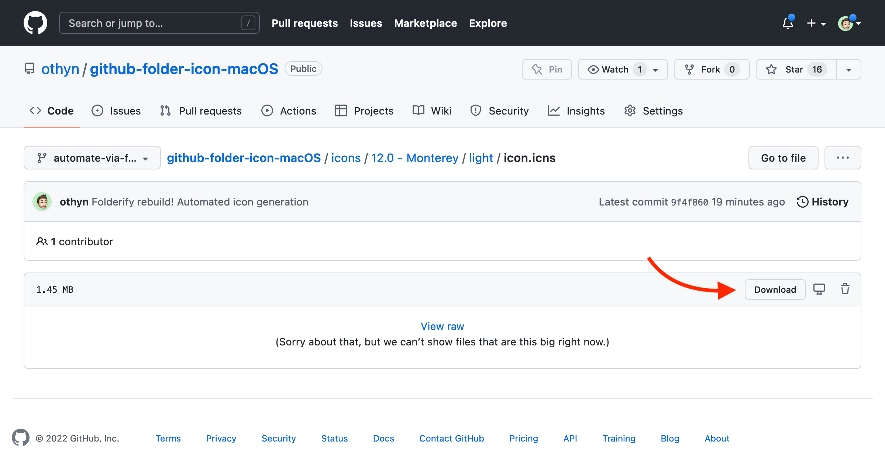
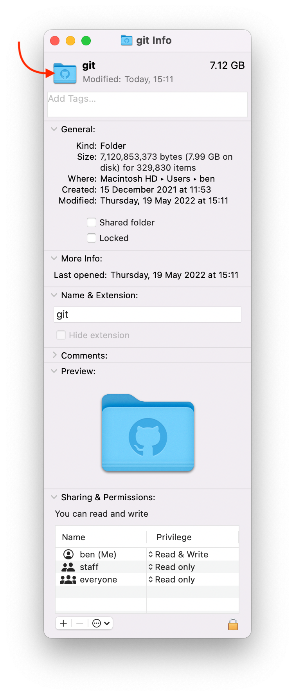

# 🍏📁 macOS GitHub Folder Icon

Made so that it fits nicely alongside all the others inside your home directory... or wherever.

What you get:

- ... 📈 A version available all the way from Mac OS X 10.5 (Leopard) through to macOS 12 (Monterey), see the [`icons`](./icons) folder
- ... 🌗 Light and Dark mode variants (where applicable, macOS 11 or later)
- ... 📁 Both `icns` and `iconset` versions of all icons
- ... 🖼️ All icon sizes from `16x16` through to `512x512@2x`

<p align="middle">
  
  &nbsp; &nbsp; &nbsp;
  
  &nbsp; &nbsp; &nbsp;
  
</p>

# 👇 Downloading the icon(s)

The easiest way will be for you to download the icon you want from the the [`icons`](./icons) directory. Simply find which macOS version you would like the icon for, and if applicable the light or dark mode variant, and download the `icns` file within that directory using GitHub's Download button once within a file's context:

<p align="middle">
  
</p>

To apply the icon, right click on the directory that you wish to update the icon of and click 'Get Info', a new dialogue window should appear. You now need to click-and-drag the downloaded `icns` file into the small icon in the top left of the window next to the directory name:

<p align="middle">
  
</p>

Ta-da! 🎉

# 🧰 Installing dependencies

I used to manually find and extract the folder icon upon every release, but someone recently introduced me to... [Folderify](https://github.com/lgarron/folderify)! Which has made maintaining this repo a breeze.

Make sure [`brew`](https://brew.sh/) is installed (don't want to automate installing this on your system) and then go ahead and run the `make` command to get things setup:

```sh
make install
```

# 🏗️ Generating icons

This is as simple as ensuring that you've already run `make install` and then running:

```sh
make icons
```

## 🎨️ Manually generating just the icons

To generate just the icons on their own, run:

```sh
make generate
```

## 🖼️ Manually generating a new preview image

To generate a new preview image, used in the README of this project, run:

```sh
make preview
```

## 🗑️ Manually cleaning Icons

If you want to quickly wipe the slate clean, run:

```sh
make clean
```

Although this step is run prior to generating new icons anyway.

# ❓ F.A.Q's

- Can I get the icon to automatically change with light/dark mode?

  - Unfortunately, no. As mentioned in the [Folderify README, under Usage](https://github.com/lgarron/folderify#usage):

    > There is currently no simple way to set an icon that will automatically switch between light and dark when you switch the entire OS. You can only assign one icon to a folder.

  - This appears to be a limitation within macOS itself and Apple currently not allowing for the distinction between two icons

# 🎂 Sources

- Amazing GitHub icon: [Dave Gandy on flaticon](https://www.flaticon.com/free-icon/github-logo_25231)
- Superb icon generation: [Folderify](https://github.com/lgarron/folderify)
- Fabulous macOS package manager: [`brew`](https://brew.sh/)
